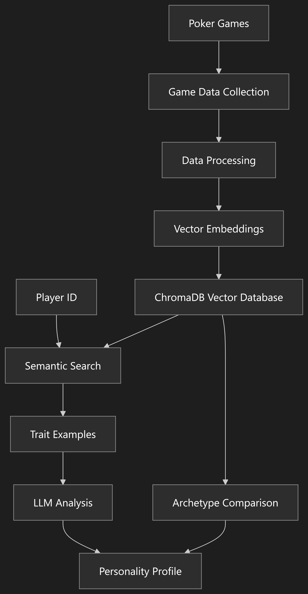

# Poker Player Personality Analysis System

## AutoGen Implementation

The project includes an innovative implementation of poker agents using Microsoft's AutoGen framework, which enables more natural and personality-driven interactions between AI agents.

```
┌────────────────────────────────────────────────── Dealer / UI ──────────────────────────────────────────────────┐
│  • Keeps official game state (pots, stacks, board)                                                             │
│  • Sends **public** state to the seat whose turn it is                                                         │
│  • Receives a strict JSON action + chat line                                                                   │
└───────────────────────────────▲─────────────────────────────────────────────────────────────────────────────────┘
                                │   public state (chat, state....)
                                │
                                ▼
  ┌───────────────────────────── LLM wrapper (“PlayerAgent”) ───────────────────────────────┐
  │  • AutoGen agent that owns its own personality (will effects decision )                 │
  │  • Calls the **Solver Core** tool                                                       │
  │  • Gets back a probability vector, samples an action,                                   │
  │    → returns `{action, amount, chat}` JSON to Dealer                                    │
  │                                                                                         │
  │                                                                                         │
  └───────────────▲──────────────────────▲───────────────────────────────────────────────────┘
                  |  tool                │   action
                  │                      │
                  │                      |
                  ▼                      │
      ┌────────────────────────── Solver Core                        ─────────────────────────┐
      │                                                                                       │
      │  Input  → current sub-game description                                                │
      │  Output → probability vector: {fold: 0.22, call: 0.38, raise 75: 0.40}                │
      └────────────────────────────────────────────────────────────────────────────────────────┘

```

### AutoGen Poker Agents

- **Agent Architecture**:

  - Extends AutoGen's `AssistantAgent` class to create `PlayerAgent` instances
  - Each agent has a distinct personality profile that influences both decision-making and communication style
  - Agents communicate through AutoGen's group chat mechanism

- **Personality-Driven Behavior**:

  - Six distinct personality types:

    - tight-aggressive
    - loose-passive
    - crazy
    - rock
    - tricky
    - calling station

    ex:

    ```json
    "tight_aggressive": {
        "traits": {
            "aggression": 0.75,      # High aggression
            "bluff_tendency": 0.30,  # Moderate bluffing
            "risk_tolerance": 0.40,  # Moderate-low risk tolerance
            "adaptability": 0.65,    # Good adaptability
            "tilt_prone": 0.25,      # Low tilt tendency
            "patience": 0.80         # High patience
        }
    }
    ```

  - Each personality has specific traits (aggression, bluff tendency, risk tolerance, etc.)

  ```json
    "aggression": {
        "description": "Tendency to bet and raise rather than check and call",
    },
    "bluff_tendency": {
        "description": "Willingness to represent hands they don't have",
    },
    "risk_tolerance": {
        "description": "Comfort with variance and willingness to gamble",
    },
    "adaptability": {
        "description": "How quickly they adjust to opponents' strategies",
    },
    "tilt_prone": {
        "description": "Tendency to play emotionally after setbacks",
    },
    "patience": {
        "description": "Willingness to wait for premium hands",

    }
  ```

  - Verbal tendencies include characteristic vocabulary and communication patterns
  - Agents respond differently to the same game situations based on their personality

- **Decision Making Process**:

  - Core poker decisions (fold, check, call, raise) are determined by solver
  - The solver incorporates personality traits when determining actions
  - Agents generate natural language responses that reflect their personality and current action
  - Communication is tailored to the game state (preflop, flop, turn, river)

- **Group Chat Interaction**:
  - Agents interact in a shared group chat managed by AutoGen
  - A dealer facilitates the game flow
  - Players respond to game state updates with personality-appropriate messages
  - The system captures both the technical poker actions and the natural language exchanges

```python
python run_poker_autogen.py
```

## 1. Project Purpose and Goals

This project creates an AI-powered system that analyzes poker players' personalities based on their in-game actions and chat messages. The system:

- Collects data from poker games (actions, chat, outcomes)
- Uses semantic analysis to identify personality traits
- Compares players to established poker archetypes
- Provides detailed personality profiles with confidence scores
- Helps understand player tendencies and strategies

## 2. System Architecture



The system follows a modern AI architecture combining:

- **Vector Embeddings**: Converting text to numerical representations
- **Vector Database**: Storing and searching these representations efficiently
- **Retrieval-Augmented Generation (RAG)**: Finding relevant examples before analysis
- **Large Language Models**: Generating human-readable personality analyses

## 3. Key Components

### Data Generation and Collection

- `generate_game_history.py`: Creates synthetic poker game data
- Uses random seeds to generate diverse game scenarios
- Produces JSON files with detailed game information

### Data Storage and Indexing

- ChromaDB vector database stores embeddings of:
  - Player actions
  - Chat messages
  - Hand summaries

### Analysis Engine

- `semantic_personality_analyzer.py`: Core analysis engine
- Generates embeddings using OpenAI's API
- Performs semantic searches for personality traits
- Compares players to poker archetypes
- Generates comprehensive personality profiles

### User Interface

- `analyze_semantic_personality.py`: Command-line interface
- Takes player ID as input
- Displays analysis results and archetype matches

## 4. Data Flow

1. **Game Data Generation**:

   - Poker games are played (simulated or real)
   - Actions, chat messages, and outcomes are recorded
   - Data is stored in JSON format

2. **Data Processing and Indexing**:

   - Text data is converted to vector embeddings
   - Embeddings are stored in ChromaDB collections
   - Metadata is preserved for context

3. **Personality Analysis**:

   - User requests analysis for a specific player
   - System searches for examples of personality traits
   - Player is compared to known archetypes
   - LLM generates a comprehensive analysis

4. **Results Presentation**:
   - Detailed personality profile is displayed
   - Trait examples with similarity scores
   - Best matching archetype with confidence score

## 5. Technical Implementation

### Vector Embeddings

- Uses OpenAI's `text-embedding-3-small` model
- Enables semantic similarity search

### Semantic Search

- Finds examples of specific traits using vector similarity
- More effective than keyword matching
- Understands context and meaning

### Personality Traits Analysis

- Six core traits analyzed:
  - Aggression
  - Bluff tendency
  - Risk tolerance
  - Adaptability
  - Tilt proneness
  - Patience

### Archetype Comparison

- Compares players to six poker archetypes:
  - Tight-aggressive
  - Loose-passive
  - Maniac
  - Rock
  - Tricky
  - Calling station

## 6. Sample Output

```
SEMANTIC PERSONALITY ANALYSIS FOR PLAYER P0
================================================================================
Player P0 exhibits a tight-passive style characterized by low aggression and low risk tolerance.
They prefer to call rather than raise and are generally patient and cautious in their approach
to the game. Their chat sentiments reinforce a careful mindset, indicating that they are not
inclined to bluff or take risks.

Aggression: Low (Confident: 90%)
Bluff Tendency: Low (Confident: 85%)
Risk Tolerance: Low (Confident: 90%)
Adaptability: Low (Confident: 80%)
Tilt Prone: Low (Confident: 85%)
Patience: High (Confident: 90%)
Poker Archetype: Rock
================================================================================

Best archetype match: rock (Score: 0.85)
```

```python
  python .\analyze_semantic_personality.py P0
```

## 7. Data Structure Example

```json
{
  "document_type": "game",
  "game_id": "game_15351134",
  "timestamp": "2025-05-05T22:03:03.369385",
  "players": {
    "P0": {},
    "P1": {}
  },
  "actions": [
    {
      "document_type": "game_action",
      "game_id": "game_15351134",
      "player_id": "P1",
      "action": "raise",
      "amount": 40.0,
      "game_stage": "preflop",
      "text_description": "P1 raised to 40.0 in unknown position during preflop"
    }
  ],
  "chat_messages": [
    {
      "document_type": "chat_message",
      "game_id": "game_15351134",
      "player_id": "P1",
      "message": "I'll raise to 40.0 and see if anyone wants to join the fun!",
      "sentiment": "aggressive",
      "associated_action": "raise"
    }
  ],
  "hand_summary": {
    "winner": "P1",
    "pot_amount": 310.0,
    "showdown_reached": false,
    "final_board": "5h 9d 4d Td"
  }
}
```

## 8. Future Improvements

- **Real-time Analysis**: Analyze players during live games
- **Multi-player Dynamics**: Study how players interact with each other
- **Visualization Tools**: Create visual representations of player tendencies

## 9. Technical Requirements

- Python 3.8+
- OpenAI API key
- ChromaDB
- Required packages: `openai`, `chromadb`, `numpy`, `python-dotenv`

This project demonstrates the power of combining vector embeddings, semantic search, and large language models to create sophisticated personality analysis systems that can be applied not just to poker, but potentially to any domain where behavior analysis is valuable.
