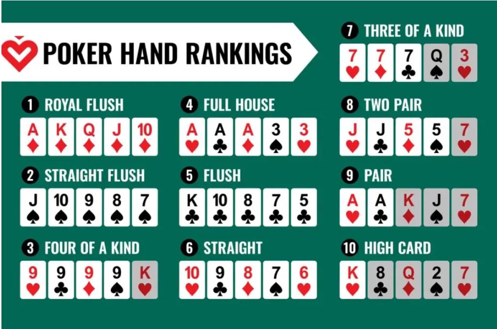

## 🎯 Goal

Make the best 5-card poker hand using your 2 private cards + 5 shared community cards.

## Setup

- 2 to 10 players

- Everyone gets 2 face-down cards (your "private cards")

- Then 5 community cards are dealt face-up in the center, in stages.

## Visualization

```
Player 1            Player 2            Player 3
 __   __             __  __               __  __
|A♠| |K♠|           |9♣||9♦|             |J♠||Q♠|
|__| |__|           |__||__|             |__||__|
          Community Cards:
           [Flop]             [Turn]    [River]
            ___  __  __        __         __
           |10♠||5♦||Q♦|      |K♣|       |J♥|
           |___||__||__|      |__|       |__|
```

Everyone makes the best 5-card hand using any combo of:

- Their 2 private cards

- The 5 community cards

## Game Flow: The 4 Betting Rounds

1. Pre-Flop

   - Players get 2 cards each

   - First round of betting

2. Flop

   - Dealer reveals 3 community cards

   - Second round of betting

3. Turn

   - Dealer reveals 4th community card

   - Third round of betting

4. River

   - Dealer reveals 5th and final community card

   - Final betting round

## Basic Betting Actions

- Fold: Give up your hand

- Call: Match the current bet

- Raise: Increase the bet

- Check: Pass without betting (only if no one bet yet)

## Winning

There are two ways to win in Texas Hold'em:

1. Everyone folds to your bet:

   - If you bet or raise, and everyone else folds, you win the pot immediately — no need to show your cards.

2. Showdown (final comparison)

- If two or more players call the final bet, you go to showdown:
- Everyone still in reveals their hole cards.

Best 5-card poker hand wins, using any combination of:

- Your 2 private cards
- The 5 community cards

### hand ranking:



## Example – Who Wins?

```
Player 1            Player 2            Player 3
 __   __             __  __               __  __
|A♠| |K♠|           |9♣||9♦|             |J♠||Q♠|
|__| |__|           |__||__|             |__||__|
          Community Cards:
           [Flop]             [Turn]    [River]
            ___  __  __        __         __
           |10♠||5♦||Q♦|      |K♣|       |J♥|
           |___||__||__|      |__|       |__|
```

Now calculate:

Player 1: A♠ K♠ + Q♦ K♣ J♥ = Straight (10-J-Q-K-A)

Player 2: Pair of 9s

Player 3: J♠ Q♠ + Q♦ K♣ J♥ = Two pair (Jacks and Queens)

✅ Player 1 wins with a straight
